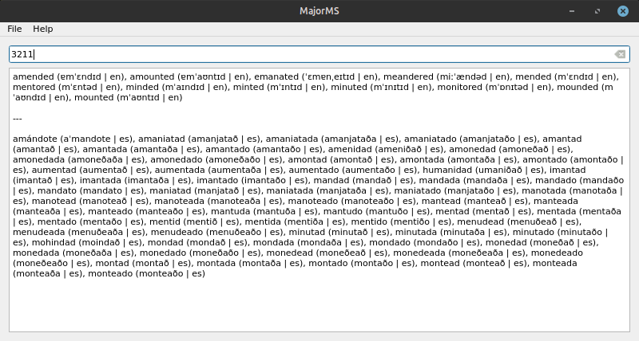

# MajorMS



Major Mnemonic System (MajorMS), is a tool that converts numbers into words.

It is based on the [Major System](https://en.wikipedia.org/wiki/Mnemonic_major_system) (also called the phonetic number system, phonetic mnemonic system, or Hérigone's mnemonic system). The system works on the principle that images visualized from words can be remembered more easily than raw numbers.

## Build instructions

These are the requirements to needed to build this project:

1. A C++ compiler with support C++ >= 20
1. CMake >= 3.23
1. Conan >= 2.19.1

Execute the following script:

```shell
./build.sh
```

## About the dictionaries

All the dictionaries contained in the `data` directory and stored as `TXT` files, have been obtained from the project [IPA Dict](https://github.com/open-dict-data/ipa-dict) that is part of [Open-Licensed dictionary data](https://open-dict-data.github.io/) project and therefore they retain their original licenses.
